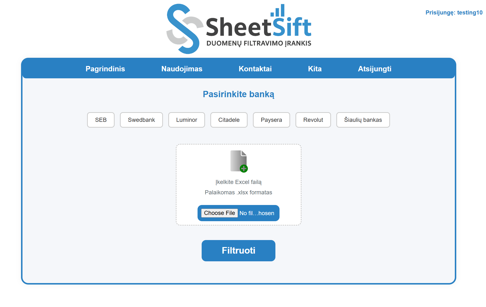

# SheetSift

**SheetSift** is a robust web application for securely uploading, processing, and managing bank statement spreadsheet files. Built with Python’s Flask framework, it features user authentication, an admin dashboard, and a modular architecture to support custom data processing.



---

## 🚀 Key Features

- **Secure User Authentication**  
  Login system powered by Flask-Login and bcrypt password hashing.
- **Admin Dashboard**  
  Manage users and review uploads with Flask-Admin.
- **Flexible File Uploads**  
  Supports uploading XLSX spreadsheets; processes and cleans data for easy analysis.
- **Custom Filtering**  
  Easily extend or add new spreadsheet filters in the `sheetsift/filters/` directory.
- **Database Agnostic**  
  Uses SQLite by default, can be configured for other databases using SQLAlchemy.
- **Error Handling**  
  User-friendly custom 404 error page and robust input validation.
- **Clean, Modular Codebase**  
  Separation of routes, authentication, models, filters, static assets, and templates for easy maintenance and extension.

---

## 🗂️ Project Structure

```
run.py                        # Application entry point
sheetsift/
  __init__.py                 # App factory & Flask extension setup
  models.py                   # Database models (User, etc.)
  routes.py                   # Main routes
  auth.py                     # Authentication routes
  utils.py                    # File cleanup utilities
  filters/                    # Custom spreadsheet filter logic
  static/                     # CSS, images, etc.
  templates/                  # HTML templates
tests/                        # (If present) Automated tests
uploads/, results/            # (Created at runtime) File storage
```

---

## 🛠️ Tech Stack

- **Backend:** Python, Flask, Flask-Login, Flask-Bcrypt, Flask-Admin, SQLAlchemy
- **Frontend:** HTML, CSS (Bootstrap 4 via Flask-Admin)
- **Database:** SQLite (default), easily switchable
- **Other:** Modular filter system for extensibility

---

## ⚡ Quick Start

### Prerequisites

- Python 3.8+
- pip

### Installation

```bash
git clone https://github.com/Rkasirovas/Sheetsift.git
cd Sheetsift

# (Optional) Create and activate a virtual environment
python -m venv venv
source venv/bin/activate  # On Windows: venv\Scripts\activate

# Install requirements
pip install -r requirements.txt

# Run the app
python run.py
```

Open your browser at [localhost:5000](http://127.0.0.1:5000/) to access SheetSift.

---

## ⚙️ Configuration

Configuration is set in `run.py` using the `config` dictionary:

- `UPLOAD_FOLDER`: Directory for uploads
- `RESULT_FOLDER`: Directory for processed files
- `SQLALCHEMY_DATABASE_URI`: Database connection string

---

## 🧑‍💼 Usage

1. Register or log in.
2. Upload your bank statement spreadsheets via the web UI.
3. Process and download results.
4. Admins can manage users at `/montywizardpython`.

---

## 💡 Extending & Development

- Add custom spreadsheet filters in `sheetsift/filters/`.
- Extend models, routes, or templates as needed.
- Runs in debug mode by default for easier development.

---

## 📁 Folder Highlights

- `sheetsift/filters/` — Custom filter logic for spreadsheet types
- `sheetsift/static/` — CSS, image assets
- `sheetsift/templates/` — HTML templates (including custom `404.html`)
- `tests/` — (If present) Unit and integration tests

---

## 🙋 About

SheetSift was created as a final assignment by [Rkasirovas](https://github.com/Rkasirovas).
